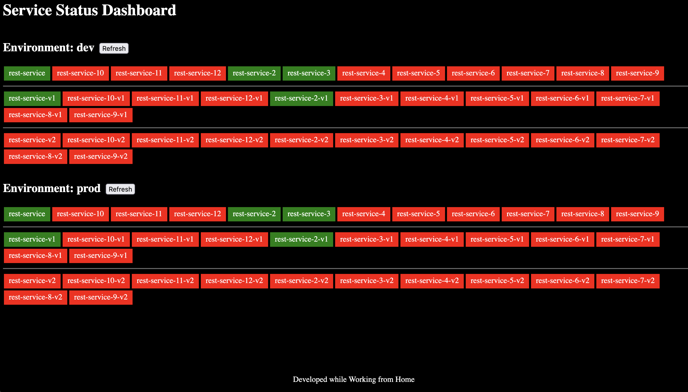

# ms-dashboard

Repository for high-level microservices overview. Idea is to simplify working with multiple services.

## Usage

``` bash
# [optional] start dummy server with health endpoints
make mock

# or set values for dummy server
export HEALTH_URL_PATTERN="http://{env_dnd}{BASE_URL}/{service}{version}/health"
export LOGS_URL_PATTERN="{LOGS_BASE_URL}/{CLUSTER_NAME}/{env}/{service}{version}/logs?project={PROJECT_NAME}"
export LOGS_BASE_URL="localhost:9001/sb/logsbase"
export CLUSTER_NAME=cluster-name
export PROJECT_NAME=proj-name
export SERVICE_NAMES=rest-service,rest-service-2,rest-service-3,rest-service-4,rest-service-5,rest-service-6,rest-service-7,rest-service-8,rest-service-9,rest-service-10,rest-service-11,rest-service-12
export VERSIONS=,-v1,-v2
export BASE_URL=localhost:9001/sb
export ENVIRONMENTS=dev,staging,prod

# start service
make start
```

## Screenshots


